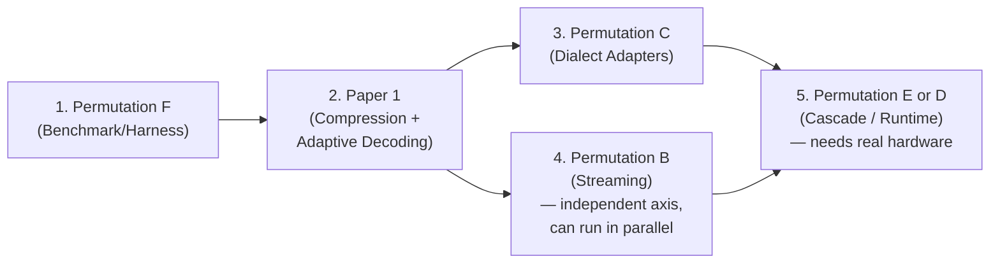

# Scoping Plan: Low-Resource, Low-Compute Marathi ASR

**From "I can implement everything" to one clean journal paper**

---

## The Core Problem You're Solving

You have ~7–8 good ideas and can implement all of them. That's a thesis's worth of work, not one paper's worth. The failure mode to avoid is a paper that touches 5 things shallowly — reviewers will read that as unfocused, and you'll end up defending 5 weak claims instead of 1 strong one.

**The fix:** pick a tightly-coupled 3-part story for Paper 1, and explicitly park the rest as later thesis chapters / Paper 2. This document draws that line.

---

## Novelty Check — What's Already Out There

### Contribution 1 (Usage-Informed Pruning of Multilingual ASR for One Language)

Very close prior art:

- **ASR Pathways** (Google, 2022) — learns per-language sub-networks in a multilingual RNN-T, explicitly to avoid language-agnostic pruning hurting specific languages.
- **DAMA** (2026, depth-aware multilingual adaptation) — layer-wise language-specificity analysis + adaptation, very close in spirit.
- A 2026 paper on **multilingual encoder compression** (vocab trim + structured pruning + distillation combined) for low-resource langs — same recipe, different modality (text, not speech).

### Contribution 2 (CTC-Gated Adaptive Compute for Transducer Decoding)

> [!CAUTION]
> **This is already published, multiple times:**
> - "Accelerating RNN-T Training and Inference Using CTC Guidance" (2022, blank-frame skipping via co-trained CTC)
> - "Blank-regularized CTC for Frame Skipping in Neural Transducer" (Interspeech 2023)
> - Hybrid CTC-Transducer models generally use exactly this blank/confidence-gated skip mechanism
>
> **This is not novel as stated.**

### Vaani / SraVaani

Real and released. SraVaani-1.0 released Aug 2026 (430M FastConformer, hybrid TDT-CTC, 65 languages). Marathi WER ~19.7–28% depending on latency setting — good, current baseline to cite.

### Dialect LoRA + Federated Updates

- LoRA-for-ASR-personalization is common (several 2024–25 papers, mostly speaker adaptation, not dialect).
- Federated ASR for Indic languages exists (CodeFed) but for code-switch detection, not LoRA dialect adapters.
- **The specific combo (dialect LoRA + connectivity-aware federated averaging) looks genuinely under-explored.**

### Other Ideas

Akshara-level streaming units, ambiguity-adaptive look-ahead, two-tier residency/paging, thermal-aware scheduling — no direct hits found; likely still open, but search wasn't exhaustive on each.

---

## Critiques & Fixes

### 1. Paper 1 — Compression + Adaptive Decoding + Constrained-CPU Protocol

**Issue:** Contribution 2 (CTC-gated fast path) substantially overlaps published work (CTC-guided RNN-T skipping, blank-regularized CTC frame skipping). A reviewer familiar with transducer literature will flag this as incremental, not novel. Contribution 1 also overlaps ASR Pathways / DAMA conceptually (though those are pathways/adapters, not pruning + retokenization specifically).

**Fix:** Reposition Contribution 2 as *not* the novelty — cite CTC-guidance work explicitly, and frame it as "we apply known CTC-gating to our compressed model and show it composes with compression" rather than claiming it as a new mechanism. Put the real novelty weight on Contribution 1 (usage-informed pruning + vocab right-sizing combo, specifically for Indic phonetic transfer) and Contribution 3 (the constrained-CPU protocol), explicitly differentiating from:
- ASR Pathways (which learns sub-networks during training, not post-hoc activation-based pruning of an existing model)
- The text-only multilingual encoder compression paper (different modality)

### 2. Permutation B — Content-Adaptive Streaming

**Issue:** No direct prior-art hit found, but that itself is a risk — akshara-level output units for streaming is a strong linguistic claim that needs strong baselines (fixed-chunk cache-aware streaming) and may be hard to isolate causally (is the gain from akshara units or from adaptive look-ahead?).

**Fix:** Run a 2×2 ablation (unit type × look-ahead policy) so reviewers can't dismiss it as confounded. Also check Kannada/Tamil conjunct-heavy streaming ASR literature specifically (not just general streaming) before committing — search wasn't exhaustive here.

### 3. Permutation C — Dialect LoRA + Federated Updates

**Issue:** Depends on Vaani's district metadata being a valid dialect proxy — this is asserted, not verified. If district ≠ dialect boundary, the whole framing weakens.

**Fix:** Validate this first (cheap): check inter-district WER variance and any linguistic dialect maps for Marathi before scoping the paper. If proxy is weak, reframe as "regional variation" not "dialect," which is a smaller but still defensible claim.

### 4. Permutation D — Runtime Scheduling

**Issue:** You flagged this yourself — thermal throttling doesn't simulate credibly. Reviewers in systems venues (MobiSys/EMSOFT) will reject thermal claims with no physical device.

**Fix:** Scope down to residency + paging only, as noted. Actually cut thermal-aware scheduling from the paper entirely rather than caveating it — a claim you can't test shouldn't be in a submitted paper at all, only in future work.

### 5. Permutation E — Offline Cascade

**Issue:** Reuses Contribution 2's confidence-gating idea as escalation trigger — same overlap-with-prior-work risk as Paper 1.

**Fix:** Differentiate escalation-policy-for-cascade (two separate models) from frame-level blank-skipping-within-one-model (existing work) — these are actually different problems, just say so explicitly in related work to preempt confusion.

### 6. Permutation F — Benchmark/Harness Paper

**Issue:** Lowest technical risk, but benchmark-only papers face "why should we care" pushback without a demonstrated technique benefiting from it.

**Fix:** Strengthen by including at least one baseline technique's numbers (even a simple quantized baseline) in the resource paper itself, not just the harness.

> [!IMPORTANT]
> **Overall biggest risk across all approaches:** Contribution 2 is the weak link everywhere it appears (Paper 1 and Permutation E) because it's genuinely been done. Fix that framing before anything else — it's a 30-minute related-work rewrite, not a redesign.

---

## Recommended Scope for Paper 1

### Working Title

> "Language-Specialized Compression and Adaptive-Compute Decoding for Low-Resource Marathi ASR on Resource-Constrained Hardware"

### The Single Research Question

> Given a multilingual Indic ASR model, how much of its capacity is language-general vs. wasted on languages you don't need, and can removing the waste — combined with runtime compute that adapts to utterance difficulty — get Marathi ASR to run well within a low-end device's budget without retraining from scratch or losing cross-lingual transfer?

---

### Contribution 1 — Language-Specialized Compression

1. **Vocabulary right-sizing:** retokenize on Marathi-only text, shrink the SentencePiece vocab from the multilingual ~5000 pieces down to ~500–1000. This directly shrinks the embedding table and (critically, in a Transducer/TDT) the joint network's output projection — often one of the largest parameter blocks when vocab is large.

2. **Language-usage-informed structured pruning:** run Marathi audio through the full multilingual encoder (e.g. SraVaani), collect per-head/per-channel activation statistics, and prune the heads/channels disproportionately used by other languages while keeping shared + Marathi-relevant capacity.

3. **Baselines to beat** (this is your ablation table):
   - Uniform/magnitude pruning to the same parameter budget
   - A from-scratch small Marathi-only model at the same budget
   - Generic output-only knowledge distillation at the same budget

4. **The claim:** usage-informed pruning retains more cross-lingual phonetic transfer (Marathi shares phone inventory with Hindi/Konkani/Sanskrit) than the baselines, at equal size.

### Contribution 2 — Adaptive-Compute Decoding

1. Run cheap **CTC-greedy decoding** as the default path.
2. Only invoke the heavier **autoregressive predictor+joint (TDT)** pass on frames/segments where CTC confidence is low.
3. **Metric:** average-case compute (FLOPs, wall-clock under constrained CPU) reduced at equal WER vs. always running full TDT decoding.
4. **Composition with Contribution 1:** you're decoding with the compressed model, so the paper's real message is "compress once, then spend the saved budget adaptively rather than uniformly."

### Contribution 3 — A Constrained-CPU Evaluation Protocol

Since you don't have physical low-end devices right now, don't claim "tested on low-end phones." Instead, define and use an honest, reproducible proxy methodology:

| Constraint | Method |
|---|---|
| CPU threads | Cap to 1–2 via `taskset`/cgroups |
| Runtime | Quantized (ONNX Runtime INT8 or similar), not full PyTorch |
| RAM | Cap via cgroups; report peak RSS via profiler |
| Metrics reported | Model size (MB), peak RAM (MB), RTF under cap, and WER — **all four together** |

> [!NOTE]
> State explicitly in the paper: this is a simulated low-end proxy; physical-device validation is future work. Reviewers respect honesty about this far more than an implied claim you can't back up.

**Optional upgrade:** A Raspberry Pi (~\$35–75, single-board, ARM CPU, capped RAM) is a common, cheap, and citable proxy for "real ARM hardware" in TinyML papers, if you want one physical data point beyond simulation.

### Why Stop Here

Each of the other ideas (dialect adapters, real device benchmark harness) is a full contribution with its own baselines and failure modes. Bolting them on dilutes the ablation depth you can give Contributions 1–2, which are the actual novel claim. They become excellent standalone chapters/papers once this one is done.

---

## Thesis Mapping

| Chapter | Content | Status |
|---|---|---|
| 1 | Introduction, motivation (linguistic diversity, low-resource Indic ASR) | Background |
| 2 | Related work (multilingual ASR, compression, streaming, on-device ML) | Background |
| 3 | **= Paper 1:** compression + adaptive decoding + constrained-CPU protocol | **Build this first** |
| 4 | Dialect adapters (LoRA-style, using Vaani's regional/district metadata as dialect proxy) | Paper 2 candidate |
| 5 | On-device cascade + real hardware benchmark (once you have physical devices) | Paper 3 candidate / future work |
| 6 | Conclusion | — |

---

## Full Paper 1 Structure

### Abstract (150–200 words)

Problem (Indic ASR diversity vs. deployment reality) → gap (multilingual models are too big/slow for the devices most Marathi speakers actually have) → method (usage-informed compression + adaptive decoding) → result (X% size reduction, Y% compute reduction, Z WER delta) → framing (proxy-hardware evaluation, physical validation as future work).

### 1. Introduction

- Motivate with the **deployment gap**, not just the modeling gap.
- State the 3 contributions explicitly as a **numbered list** at the end of the intro (standard journal convention — makes reviewers' job easy).

### 2. Related Work *(organize by axis, not chronologically)*

- Multilingual/Indic ASR (SraVaani, IndicWav2Vec, etc.)
- Model compression for ASR (pruning, distillation, quantization)
- On-device/TinyML speech systems
- **Positioning statement:** "no prior work does usage-informed pruning specifically for monolingual specialization of a multilingual Indic ASR model"

### 3. Data

- Vaani / Vaani-transcription-part (Marathi subset), any supplementary open datasets for fine-tuning/eval.
- Report hours, speakers, regions for the Marathi subset specifically — **reviewers will ask.**

### 4. Method

- **4.1** Vocabulary right-sizing procedure
- **4.2** Activation-based importance scoring + structured pruning procedure
- **4.3** Adaptive-compute decoding (confidence gate design, threshold selection)
- Include a **system diagram:** teacher model → profiling pass → pruned student → adaptive decoder.

### 5. Experimental Setup

- Model/training details, baselines (uniform pruning, from-scratch small model, output-only KD), constrained-CPU protocol details.

### 6. Results

- **Table 1:** WER vs. model size across all methods (your headline table).
- **Table 2:** Compute (FLOPs/RTF) vs. WER for adaptive vs. fixed decoding.
- **Table 3:** Peak RAM under the constrained-CPU protocol.
- **Figure:** Pareto curve (size or compute vs. WER) — *this is the figure reviewers will remember.*

### 7. Discussion / Limitations

- Be upfront: no physical low-end device validation yet (name it as future work, don't bury it).
- Discuss where usage-informed pruning helps most/least (which languages' capacity turned out to be most "reusable" for Marathi).

### 8. Conclusion & Future Work

- Explicitly point to dialect adapters and physical-device validation as the next steps — this sets up your later thesis chapters/papers cleanly.

---

## Implementation Timeline

| Weeks | Milestone |
|---|---|
| 1–3 | Reproduce a multilingual baseline (SraVaani or similar) on your GPU environment; get Marathi eval numbers you trust |
| 4–6 | Vocabulary right-sizing + retraining/fine-tuning; measure size/WER tradeoff |
| 7–10 | Activation profiling + structured pruning implementation; run the 3 baselines for comparison |
| 11–13 | Adaptive-compute decoding on top of the best compressed model; tune confidence threshold |
| 14–15 | Build the constrained-CPU evaluation protocol; collect final numbers (size, RAM, RTF, WER) for all methods |
| 16–18 | Writing, figures, internal review, submission prep |

---

## Target Venues

| Venue | Fit Notes |
|---|---|
| **ACM TALLIP** | Best thematic fit if framed around low-resource Indic language inclusion |
| **IEEE Access** | Broad scope, good for combined modeling+systems angle, faster review cycle, open access |
| **Circuits, Systems, and Signal Processing** (Springer) | Good fit if leaning harder into the embedded/systems framing |
| **Interspeech / ICASSP** *(conference)* | Indic-language/low-resource tracks exist at both; good for feedback before journal version |

---

## Fallback Plans

> [!TIP]
> Keep all four metrics (size, RAM, RTF, WER) in every table so a "loss" on one axis can still show a win on another.

- **If usage-informed pruning barely beats uniform pruning:** reframe as a rigorous negative/mixed result — "when does language-usage information help vs. not" is still a publishable, honest contribution.
- **If vocabulary shrinking hurts WER more than expected:** report the size-vs-WER curve as a design guideline rather than a clean win — still useful to the field.

---

## Full Idea Pool (All Axes)

### Streaming / Interaction Axis

- Akshara-level (not codepoint-level) streaming output units
- Ambiguity-adaptive look-ahead (content-driven, not fixed chunk size)
- Causal code-switch gating in the joint network
- Compressed long-range "compound memory" beyond the raw activation cache
- Prosody-aware EOU/endpointing head
- Duration-bin recalibration for streaming stability

### Compression / Efficiency Axis

- Vocabulary right-sizing
- Language-usage-informed structured pruning of a multilingual teacher
- Cross-lingual phonetic feature distillation
- Confidence-gated dynamic compute (CTC fast path + selective TDT)
- Elastic/Once-for-All supernet for device tiers
- Fully integer pipeline (feature extraction + AM + decode)

### Systems / Runtime Axis

- Two-tier model residency (always-on tiny + lazy-loaded full model)
- Memory-mapped/on-demand weight streaming
- On-device cascade instead of cloud offload
- Thermal- and battery-aware inference scheduling
- Realistic low-end benchmark suite as a contribution in itself

### Personalization / Adaptation Axis

- Dialect adapters (LoRA-style, storage-constrained)
- Connectivity-aware federated adapter updates

---

## Permutation B — Streaming, Content-Adaptive Emission

**Title:** "Content-Adaptive Streaming ASR for a Morphologically Rich, Code-Mixed Language: Akshara-Level Emission and Ambiguity-Driven Look-ahead for Marathi"

**RQ:** Do Marathi's specific linguistic properties (suffix-final agreement, conjunct orthography, mid-utterance code-switching) justify departing from fixed-chunk cache-aware streaming, and does a content-adaptive approach beat it at equal latency?

**Contributions:**
1. Akshara-level output units
2. Ambiguity-adaptive look-ahead
3. Causal code-switch gating in the joint network

**Why it composes:** All three modify *when* and *what* the streaming encoder commits to emitting — one coherent mechanism, evaluated on WER + a partial-hypothesis-stability metric + latency, not on device resources at all. This is a different axis from Paper 1 (interaction quality, not compute/memory), so the two papers don't compete for the same evidence.

**Excludes:** Compound-memory cache extension and prosody-aware EOU (good follow-on additions once the core mechanism is validated — don't launch with 5 mechanisms when 3 already need a full ablation each).

**Venue fit:** ICASSP / Interspeech (streaming ASR tracks), or IEEE/ACM TASLP for the journal version.

**Relationship to Paper 1:** Shares no baselines with Paper 1, but the akshara-tokenization work is reusable infrastructure — build it once, cite it in both papers.

---

## Permutation C — Dialect Adaptation Without Duplication

**Title:** "Storage-Efficient Dialect Robustness for Marathi ASR via Federated Low-Rank Adapters"

**RQ:** Can a single small base model plus tiny per-dialect LoRA deltas, updated through bandwidth-aware federated averaging, match dedicated per-dialect models — without the storage cost of multiple checkpoints or the connectivity assumptions of standard federated ASR work?

**Contributions:**
1. Dialect adapters (LoRA-style)
2. Connectivity-aware federated update protocol
3. As the base model: whatever compressed encoder came out of Paper 1 (builds on it explicitly rather than re-deriving)

**Why it composes:** Both halves are about adapting without duplicating — one for dialect coverage, one for the update mechanism that keeps those adapters current. Natural, single narrative: "personalization under storage and bandwidth constraints."

**Data note:** Vaani's regional/district metadata (speakers tagged across 165 regions) can proxy dialect labels for an initial version — worth checking directly against the dataset before committing, since true dialect labels would strengthen the claim considerably.

**Venue fit:** Interspeech, or a journal with an Indic-language/low-resource focus (ACM TALLIP again fits well here).

---

## Permutation D — Pure Systems/Runtime Paper

**Title:** "Resource-Adaptive Runtime Management for On-Device Speech Recognition: Residency, Paging, and Thermal-Aware Scheduling"

**RQ:** How should an ASR runtime manage memory residency, weight paging, and compute-tier selection dynamically, in response to live device state (RAM pressure, thermal throttling, battery), instead of a fixed configuration chosen at build time?

**Contributions:**
1. Two-tier model residency (always-on tiny VAD + lazy-load full model)
2. Memory-mapped/on-demand weight streaming
3. Thermal/battery-aware scheduling across an elastic supernet's tiers

**Why it composes:** These are all runtime-management mechanisms operating on the same elastic model family — a genuinely different paper type from the others (systems/OS flavor, not speech-modeling flavor). Marathi ASR is just the workload you're scheduling; the contribution is the scheduler.

> [!WARNING]
> This one is hardest to do credibly without physical devices — thermal throttling in particular doesn't simulate well. If you stay GPU/simulated-only for a while, treat this as your last permutation to attempt, or scope it down to residency + paging only (both of which can be measured meaningfully via cgroups/RAM caps without needing real thermal behavior).

**Venue fit:** MobiSys, EMSOFT, IEEE Pervasive Computing, or IEEE Access for a faster, broader-scope outlet.

---

## Permutation E — Offline-First Cascade

**Title:** "A Fully-Offline Cascade Architecture for Connectivity-Constrained Marathi ASR"

**RQ:** Given unreliable connectivity (a real constraint in much of rural Maharashtra, not a hypothetical), what local two-stage cascade policy (escalation trigger + second-model size) best balances accuracy against average-case compute, with no cloud fallback assumed at all?

**Contributions:**
1. On-device cascade (tiny first-pass model, confidence-gated escalation to a larger local second model)
2. The confidence-gated dynamic-compute idea from Paper 1, reused here as the escalation trigger instead of the decode-path trigger

**Why it composes:** One clean escalation-policy question, evaluated end-to-end (not two separate mechanisms bolted together).

**Venue fit:** IEEE Access, or a mobile-systems venue if paired with real device numbers later.

> [!NOTE]
> This is the natural home for the "realistic low-end benchmark suite" idea — build the benchmark as part of evaluating this cascade, rather than as a standalone paper (a benchmark with no technique attached is a harder sell as a first paper; a benchmark that enabled a clear cascade result is a much easier one).

---

## Permutation F — Foundational Resource Paper

**Title:** "A Regionally-Annotated Marathi ASR Benchmark for Dialect and Resource-Constrained Evaluation"

**RQ:** None of the above papers can rigorously claim dialect robustness or low-end viability without a shared, well-characterized evaluation resource. This paper *is* that resource.

**Contribution:** Curate a Marathi test set from Vaani (and any supplementary sources) with regional/dialect metadata attached, paired with a documented constrained-CPU evaluation harness (the protocol from Paper 1's Contribution 3, generalized into a reusable tool).

**Why this might be your smartest move:** It's the lowest-risk paper to write (mostly careful curation + engineering, not a novel claim that could fail to replicate), and every other permutation above gets stronger if it can cite this resource and reuse its harness instead of building one-off evaluation code each time.

**Venue fit:** LREC, an Interspeech resource/dataset track, or a data-focused journal (Language Resources and Evaluation, Springer).

---

## Suggested Sequencing Across the Thesis

1. **Permutation F** (benchmark/harness) — build early, even in parallel with Paper 1; it's infrastructure everything else needs anyway.
2. **Paper 1** (compression + adaptive decoding) — your strongest, most self-contained modeling contribution.
3. **Permutation C** (dialect adapters) — builds directly on Paper 1's compressed base model.
4. **Permutation B** (streaming) — independent axis, can run in parallel with 2–3 if you have bandwidth, since it shares no baselines.
5. **Permutation E** (cascade) or **D** (runtime scheduling) — save for last; both benefit most from having real hardware, which is also when your "future work" promises from earlier papers come due.

> [!IMPORTANT]
> This gives you a thesis with 3–4 independently defensible papers instead of one paper trying to be all of them at once.
